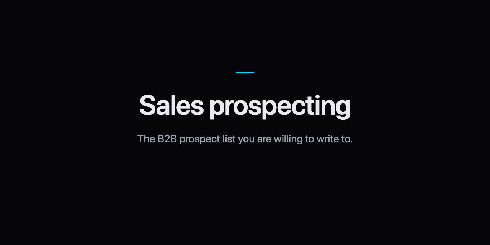
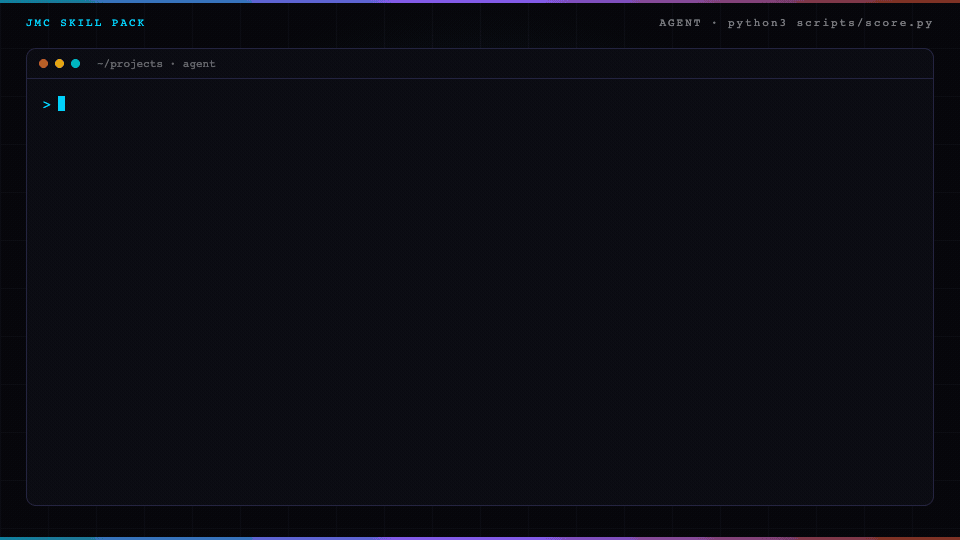

<p align="center">
  
</p>

# Sales prospecting skill for Claude Code

Sales prospecting builds the B2B prospect list you are willing to write to.

## In 60 seconds

```text
/plugin marketplace add cmj-hub/gtm-operator-skills
/plugin install prospect-list@gtm-operator-skills
/prospect-list:who-to-contact
```

Or score the sample without an agent:

```bash
python3 skills/who-to-contact/scripts/score.py --file skills/who-to-contact/examples/list-good.json    # exit 0, prints title, signal, score, then "Next: /cold-email:cold-email"
python3 skills/who-to-contact/scripts/score.py --file skills/who-to-contact/examples/list-title.json   # exit 1: - missing signal (a title with no signal is a directory, not a list) → write one thing they did this window, or leave them off
```

Part of the GTM operator suite — `/plugin install gtm@gtm-operator-skills` installs all ten.

Add the [gtm-operator mod](https://github.com/cmj-hub/gtm-operator-claude-mod) to see the suite's next step above your prompt and keep `brand-config.json` from being overwritten: `/plugin install gtm-operator@gtm-operator-skills`.

Ops lead at Northwind posted a role for an outbound lead this week.

The good draft says call this week. A title-only list fails the score.

<p align="center">
  
</p>

The build guide teaches a human. The pack teaches an agent.

## Install

As a Claude Code plugin:

```text
/plugin marketplace add cmj-hub/claude-prospect-list
/plugin install prospect-list@claude-prospect-list
```

The skill then loads as `/prospect-list:who-to-contact`. Ask Claude who to call this week, or hand it a list of titles. `/prospect-list:who-to-contact score` scores the draft already in `gtm/list.json`.

For every agent host the skills installer knows:

```bash
npx skills add cmj-hub/claude-prospect-list --all -g --full-depth
```

One host:

```bash
npx skills add cmj-hub/claude-prospect-list --skill '*' -g --full-depth -y -a claude-code
```

Swap `claude-code` for `cursor`, `codex`, `grok`, `github-copilot`, `windsurf`, `cline`, or `opencode`. The scorer is Python in this repo. It does not call a paid API, and it does not buy data.

## What you walk out with in 15 minutes

```bash
cd skills/who-to-contact
python3 scripts/score.py --file examples/list-good.json
python3 scripts/score.py --file examples/list-title.json
```

The good draft exits 0 and prints a list score from a signal. The title-only draft exits 1 and prints one `- what is wrong → what to change` line for each gap, then `Next: fix the lines above and run this again.` A persona label in place of a signal, or a score that is not `call this week`, `hold`, or `drop`, fails too. Add `--json` for one result object (`fixes` and `next` included). Then drop in yours at `gtm/list.json` in your project.

## What's in the pack

| Path | What it is |
| --- | --- |
| `skills/who-to-contact/SKILL.md` | The skill: what a signal is, how to pick the slot, the checklist. |
| `skills/who-to-contact/scripts/score.py` | The scorer. Exit 0 scored, 1 refused, 2 unreadable input. |
| `skills/who-to-contact/examples/` | Good, hold, title-only, and persona-label drafts. |
| `.claude-plugin/` | Plugin and marketplace manifests for Claude Code, and the plugin icon. |
| `tests/` | `python3 -m unittest discover -s tests` |

## What this pack will not do

It will not send the list. It does not buy data. It will not accept a title-only list.

## The data step this pack leaves to you

This pack scores who earns a slot this week from a public signal. Building the company universe and verifying emails sit outside the pack.

- [Build a company list](https://thegtmdirectory.com/jobs/build-a-company-list) — grow the account set that signals can attach to
- [Verify an email](https://thegtmdirectory.com/jobs/verify-an-email) — confirm deliverable before any send

A found address is not sendable until verify returns deliverable.

## What is a prospect list?

The people a public signal puts on this week's list. A job title with no signal is not a prospect yet.

## Does this pull leads from a database?

No. You bring the signal. The pack scores the slot: call, hold, or drop.

## On the site

- [Sales prospecting pack](https://jaymountconsulting.com/skills/claude-prospect-list) — this pack's page
- [Skill packs catalog](https://jaymountconsulting.com/skills) — install paths + every pack

## Free, no signup

[All free tools](https://jaymountconsulting.com/prototypes)

## Free, by email

[**Growth Audit**](https://jaymountconsulting.com/growth-audit) — architecture gaps in the GTM you already run. Free written report.

[**Friday Signal**](https://jaymountconsulting.com/newsletter/signal) — one Friday GTM read. No pitch in it.
## Privacy and security

The scorer is standard-library Python and opens no network connection. It reads only the draft you give it; the skill writes `gtm/list.json`, reads `brand-config.json` and never writes to it. No telemetry, no credentials, no lookups, and nothing is sent. See [SECURITY.md](SECURITY.md).

## Next

Previous: [Email sequence](https://github.com/cmj-hub/claude-email-sequence)

Next: [GTM skills for Claude Code](https://github.com/cmj-hub/gtm-operator-skills)

## License

MIT. Python 3 standard library only.
